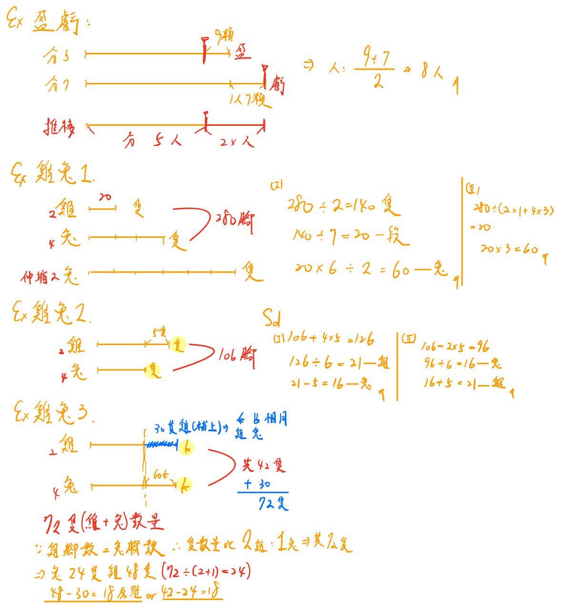

# 📖 Mac5B 上

# ⭕ 線段解題

```說課
🟡 引起動機: 

⮕ 開課題

    💡 線段示範畫法(和倍問題): 爸爸一個月發給哥哥弟弟零用錢共 500元，
       若給哥哥的是弟弟的兩倍多 20 塊，求出哥哥與弟弟個給多少?

🟡 學習內容: 

📌 理論架構:

    💡 畫線段前

        - 注意單位
        - 對齊
        - 找倍數(多出來部分不能跟等分一樣長)

    💡 畫線段後

        - 補扣(等分除)
        - 推移
        - 伸縮

🟡 學習目標: 

    - 和差、和倍、差與倍數相等、給來給去(總和不變)、年齡問題(差距不變)、逆推問題、雞兔問題

```

```選擇題目(*表需講解示範)
- 和差: B1_1*, B1_2
- 和倍: B2_1*, B2_2, B3_1, B3_3
- 給來給去: 4_1*(示範兩種畫法: 給前與給後), 4_2
- 推移: 5_1*(推移,最小公倍法, 盈虧問題), B5_2, B7_2

```

```延伸
💡 盈虧範例:
若每人分 5 顆則剩下 9 顆，若每人分 7 顆則有一人沒分到，則共有幾人?
```

```雞兔線段
💡 e.g.1 雞兔同籠，兔的隻數是雞的 3 倍，雞兔共有 280 隻腳請問兔子有幾隻?

💡 e.g.2 牙牙的園子裏養著雞和兔。只知道雞比兔多 5 隻,而牠們的腳數總共有
         106 隻。請問牙牙園子裏的雞、兔各有幾隻?

💡 e.g.3 楊伯伯養了雞、兔共有 42 隻,雞的腳數比兔的腳數少 60 隻,請問楊伯
         伯各養了雞、兔多少隻?

```


