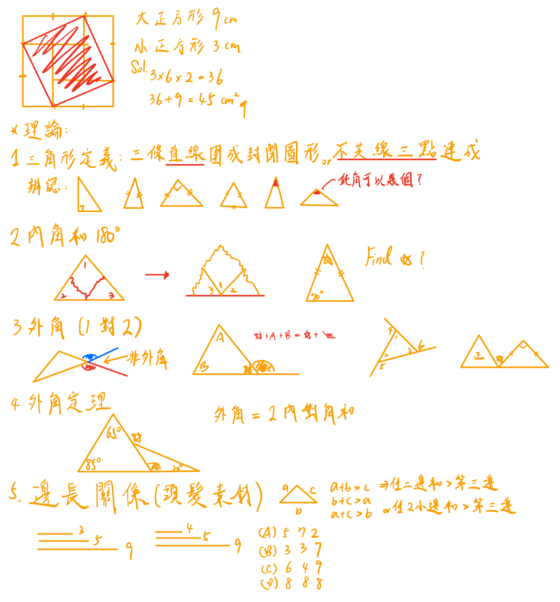

# 🟡 上課筆記

## ⭕ 10/10 M455上

> - 授課老師：方嘉老師
> - 單元：三角形的定義與性質

### 1️⃣ 課程流程

- 16:50 ~ 17:55 講解觀念
- 17:55 ~ 16:20 B23, B26_5, B26_6, B26_7, B26_8, B22~28
- 16:20 ~ 18:20

### 2️⃣ 印象深刻的題

### 3️⃣ 教學目標

 

### 4️⃣ 問題設計與引導

### 5️⃣ 學生參與情形

- 引導學生思維，不要甚麼都覺得太難了不會
- 聽懂用力點頭

### 6️⃣ 班級經營與氣氛

- 師生關係輕鬆氛圍
- 學生聲音 > 老師，就扣一勾
- 師生頻率相通

### 🔦 互動討論

### 🔦 思考

- 好的廚師需要好的食材好的備料，老師需要尋找的題目素材

---

