# 📖 最值的研究

# ⭕ 如何尋找最大最小?

```Mnemonic
💡 求極值:
1. 一元二次配方法
2. 一元二次判別式
3. 算幾
4. 柯西
5. 畫圖
6. 參數
7. 微分
```

## 🟡 一元二次配方法

### 1️⃣ 定義

已知: 二次函數 y = f(x) = ax² + bx + c, a ≠ 0, a, b, c ∈ ℝ, 圖形為一拋物線

若: 配方可得 y = f(x) = a(x - h)² + k

則:

- a > 0 時，有最小值: k
- a < 0 時，有最大值: k

### 2️⃣ 如何使用一元二次配方法

> **💫 How: 一元二次配方法**
>
> 1. 一元二次配方法: 配合代換法，注意變數範圍，有範圍時畫圖切斷
> 2. 多元時: 一元一元配，先就 x 配剩下 y，再將 y 配剩常數
> 3. 多項時: 當 x = 算術平均數時候，就有最小值

### 3️⃣ 常見的代換法及變數範圍

> 1. t = x² + 4x + 5 ⇒ (x + 2)² + 1 `≥ 1`
> 2. t = x + 1/x ⇒
>    > - x > 0, `t ≥ 2` (by A ≥ G)
>    > - x < 0, `t ≤ -2` (by A ≥ G; [(-x)+(-1/x)]/2 ≥ √(-x)(-1/x))
> 3. t = 2ˣ ⇒ x `t ≥ 0`
> 4. t = 2ˣ + 2⁻ˣ `t ≥ 2` (by A ≥ G)
> 5. t = log x `t ∈ ℝ`
> 6. t = |x| `t ≥ 0`
> 7. t = sinθ `-1 ≤ t ≤ 1`
> 8. t = tanθ + cotθ `t ≥ 2` (by A ≥ G) // Equality holds when: θ = π/4 + 2kπ (k ∈ ℤ)

> **📌 範例:**
>
> → 試求下列各式之 y 之範圍:
>
> $$\text{💡e.g.1.1:} ~ y = (x^2 + 6x + 3)(x^2 + 6x + 8) + 3x^2 + 18x + 2$$
>
> $$\text{💡e.g.1.2:} ~ y = x^2 + 6x + 9 + \frac{6}{x} + \frac{1}{x^2}$$
>
> $$\text{💡e.g.1.3:} ~ y = x^2 - 4 \left | x \right | + 6$$
>
> $$\text{💡e.g.1.4:} ~ y = 4^x + 2^{x + 3} + 8$$
>
> $$\text{💡e.g.1.5:} ~ y = 4^x + 4^{-x} - (2^{1 + x} + 2^{1 - x}) + 6$$
>
> $$\text{💡e.g.1.6:} ~ y = (\log_{2}{4x})(\log_{2}{\frac{x}{8}}), ~ 4 \le x \le 16$$
>
> ---
>
> $$\text{💡e.g.2: 設 x, y ∈ ℝ;} ~ f(x, y) = x^2 + 2xy + 3y^2 + 2x + 10y + 7$$
>
> $$~ 求 f(x, y) 的最小值?$$
>
> 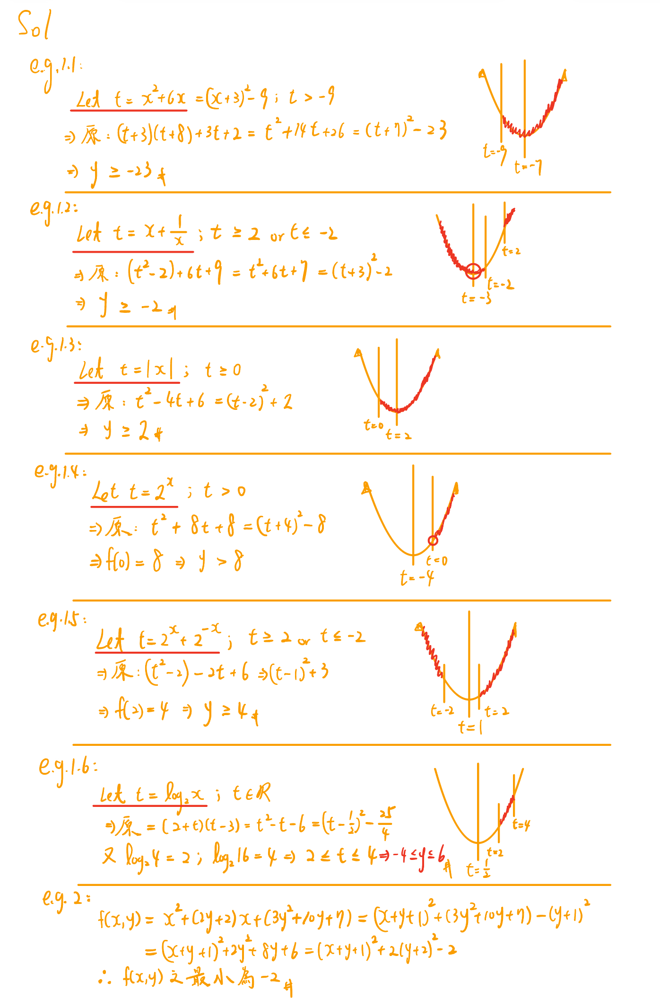
>
> ---
>
> $$\text{💡e.g.3.1: } f(x) = (x - 1)^2 + (x - 2)^2 + (x - 3)^2 + (x - 4)^2 + (x - 5)^2$$
>
> $$\text{試求: x = ? 時，f(x) 有最小值 = ?}$$
>
> $$\text{💡e.g.3.2: } f(x) = (x - 1)^2 + 2(x - 2)^2 + 3(x - 3)^2 + 4(x - 4)^2 + 5(x - 5)^2$$
>
> $$\text{試求: x = ? 時，f(x) 有最小值 = ?}$$
>
> ---
>
> $$\text{💡e.g.4: 一個農夫有一條長 20 公尺的繩子}$$
>
> $$\text{💡e.g.4.1: 若圍成一矩形的農地的四周圍問，問各應如何圍才能圍成最大面積?}$$
>
> $$\text{💡e.g.4.2: 若圍成一矩形的農地的其中三邊，問各應如何圍才能圍成最大面積?}$$
>
> ---
>
> $$ \text{💡e.g.5: 已知對於任何實數 k，方程式 } ~ τ: x^2 + y^2 + 2kx - kx + (k-1) = 0$$
> $$ \text{ 恆表一圓，求所有方程式 τ 可形成的圓中，其半徑的最小值為何? }$$
>
> ---
>
> $$\text{💡e.g.6: 已知} ~ \vec{a} = (2, ~ 1), ~ \vec{b} = (4, ~ 5), ~ t \in \mathbb{R}, ~ \text{求} ~ \left| \vec{a} + t\vec{b} \right| ~ \text{之最小值？}$$
>
> 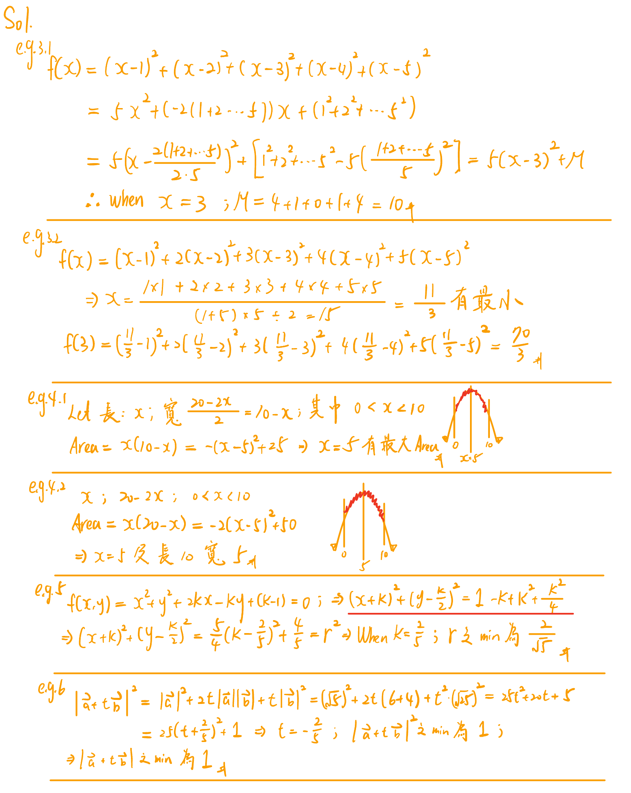

## 🟡 一元二次判別法

### 1️⃣ 定義

已知: y = ax² + bx + c, a ≠ 0, a, b, c ∈ ℝ, 圖形為一拋物線

若: 求 y 範圍

則: 可視為求與拋物線有交點之水平線範圍

❗注意: 有範圍時候不能用

> 💡e.g: 求 y = x² + 2x + 3 之範圍
>
> 可將拋物線 y = x² + 2x + 3 與水平線 y = k 聯立
>
> - y = x² + 2x + 3
> - y = k
>
> ∵ 有焦點 ⇒ y = x² + 2x + 3 - k = 0 有實根
>
> ∴ ∆ ≥ 0 ⇒ 2² - 4⋅1⋅(3 - k) ≥ 0 ⇒ 4k ≥ 8 ⇒ k ≥ 2

### 2️⃣ 推廣

1. 已知: 二元二次式曲線方程式，求直線範圍?

- 二元二次式曲線方程式
  - 圓: x² + y² = r²
  - 拋物線: y² = 4cy
  - 橢圓: x²/a² + y²/b² = 1
  - 雙曲線: x²/a² - y²/b² = 1
- 直線
  - 水平線 y = k
  - 鉛錘線 x = k
  - 平行線 x + y = k

2. 求出分式值域

$$● ~ \frac{二次}{一次}: y = \frac{x^2 + 1}{x} = x + \frac{1}{x}$$
$$● ~ \frac{一次}{二次}: y = \frac{x}{x^2 + 1}$$
$$● ~ \frac{二次}{二次}: y = \frac{x^2 - x + 1}{x^2 + x + 1}$$

> **📌 範例:**
>
> $$💡e.g.1: 已知 x^2 + xy + y^2 - 2x - 2y -4 = 0$$
>
> $$→ ~ 求出 ~ 1. ~ x ~ 範圍; ~ 2. ~ y ~ 範圍; ~ 3. ~ x + y ~ 範圍$$
>
> $$💡e.g.2: 設 ~ x \in \mathbb{R}, ~ f(x) = \frac{x^2 - x + 1}{x^2 + x + 1} ~ 則求出當 ~ x ~ 為何? ~ y ~ 之最大最小?$$
>
> $$💡e.g.3: 設 ~ p(x, ~y) ~ 為圓形 ~ (x - 1)^2 + (y + 4)^2 = 5 ~ 上一點，求 ~ x + 2y ~ 之最大值?$$
>
> 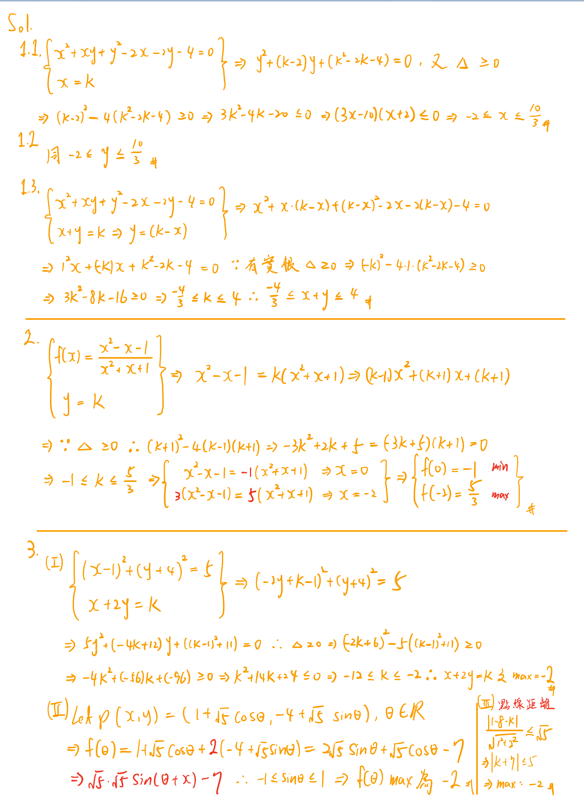
>
> $$💡e.g.4: 若直線 ~ y = m(x + 4) ~ 與 ~ (x - 1)^2 + (y - 2)^2 = 4 ~ 有交點，試求 ~ m ~ 範圍?$$
>
> $$💡e.g.5: 試求 ~ y = \frac{2 - \sin\theta}{1 - \cos\theta}$$
>
> 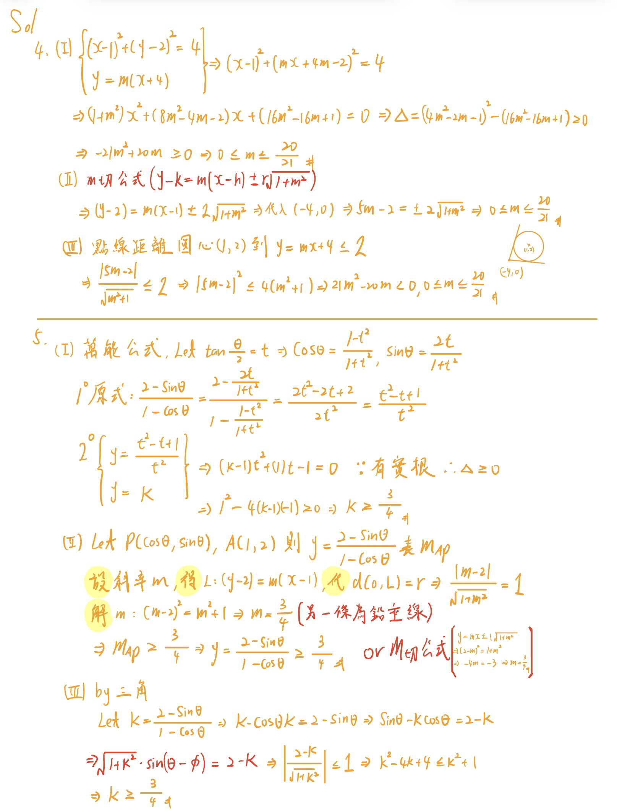

## 🟡 算幾不等式 (Arithmetic-Geometric Mean Inequality)

### 1️⃣ 定義

已知: a, b 為二正數

則: a + b / 2 ≥ √ab (算術平均數 ≥ 幾何平均數)

其中: "=" 成立時候, a = b

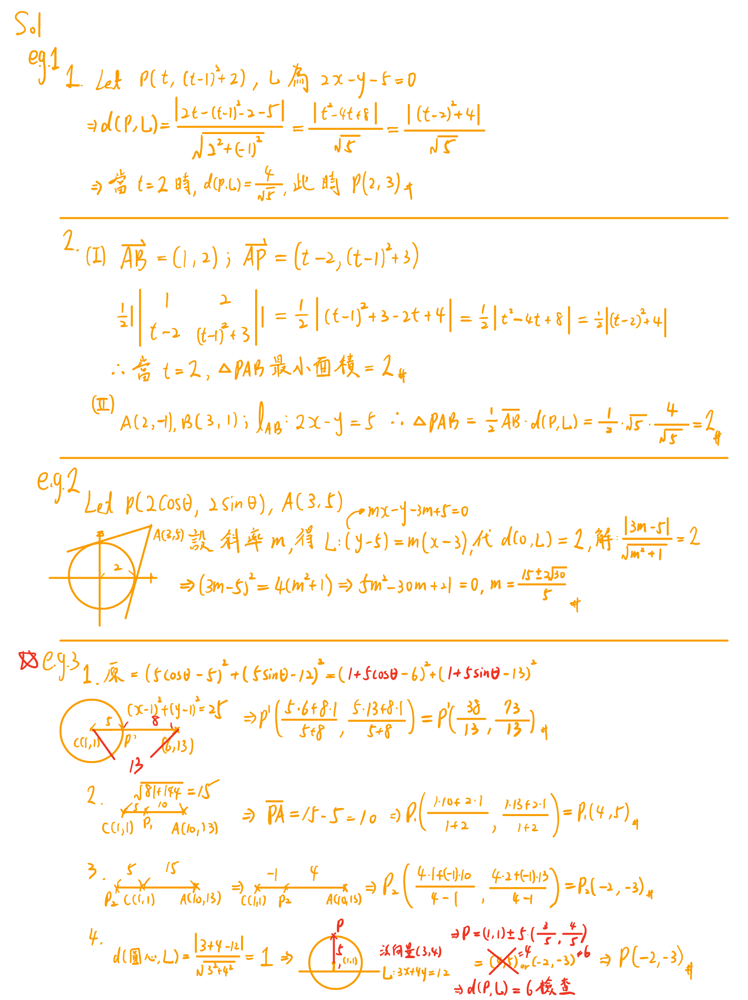

### 2️⃣ 推廣

已知: a₁, a₂, ... aₙ 為 n 個正數

則: (a₁ + a₂ + ... + aₙ) / n ≥ √(a₁ ⋅ a₂ ⋅ ... ⋅ aₙ) [和 / n ≥ √積]

### 3️⃣ 何時利用 A ≥ G，來求極值?

- 已知和，求積之最大值
- 已知積，求和之最小值
- 看到"倒數和"

### 4️⃣ 如何利用 A ≥ G，來求極值?

1.  先判別有幾個數作 A ≥ G (決定 n)
2.  如何決定有幾個數做 A ≥ G ? → 由乘積決定，變數幾方，就分幾份

> **📌 範例:**
>
> $$\text{💡e.g.1: 設 } ~ x > 0, ~ y > 0, ~ 3x + 2y = 12，則試求下列之最大值?$$
>
> $$(1) ~ xy; ~ (2) ~ xy^2$$
>
> $$\text{⭐e.g.2: 設 } ~ x, y ∈ ℤ⁺, ~ 滿足 ~ x + 2y = 5，則 ~ 2^x + 2^y ~ 的最小值?$$
>
> $$\text{⭐e.g.3: 設 } ~ 0 < x < 1，求 ~ \log_{2}{x} + \log_{x}{16} ~ 之最大值?$$
>
> $$\text{💡e.g.4: 設 } ~ x > 0, ~ y > 0，則試求 ~ (x + \frac{1}{4y})(9y + \frac{1}{x}) ~ 之最小值?$$
>
> $$\text{💡e.g.5.1: 若 } ~ x > 0, ~ 且 ~ f(x) = x + \frac{1}{x} + \frac{8x}{x^2 + 1} ~ 則試求 ~ f(x) ~ 之最小值?$$
>
> $$\text{💡e.g.5.2: 若 } ~ x \in \mathbb{R}， ~ 且 ~ f(x) = \frac{x^4 + 2x^3 + x^2 + 1}{x^2 + x + 1} ~ 則試求 ~ f(x) ~ 之最小值?$$
>
> $$\text{⭐e.g.6: 設 } ~ -\frac{1}{3} < x < \frac{5}{3}， ~ 則試求 ~ (3x + 1)^2(5 -3x) 之最大值?$$
>
> 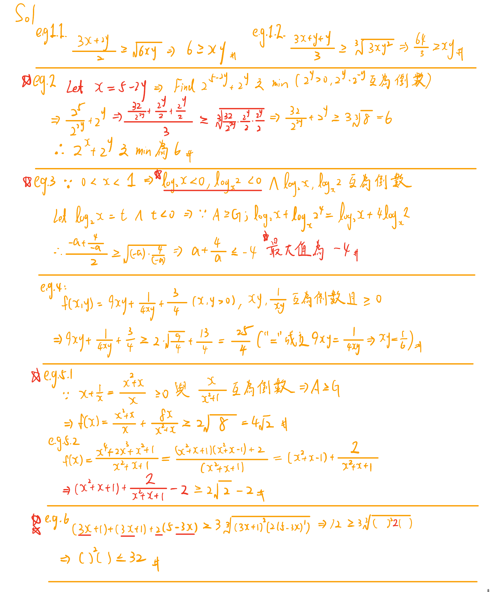
>
> $$\text{⭐e.g.7: 求 } ~ y = \sin^2\theta\cos\theta ~ 之範圍?$$
>
> $$\text{💡e.g.8: 一長寬各 50 cm 的正方形紙片，四角截去一正方形 }$$
>
> $$\text{可拆成一無蓋的盒子，求此盒子之最大容積? }$$
>
> $$\text{⭐e.g.9: 對於一圓柱罐頭，若容積固定，則高 h、底半徑 r }$$
>
> $${ 比例為何時，可使製造罐頭材料最省? }$$
>
> 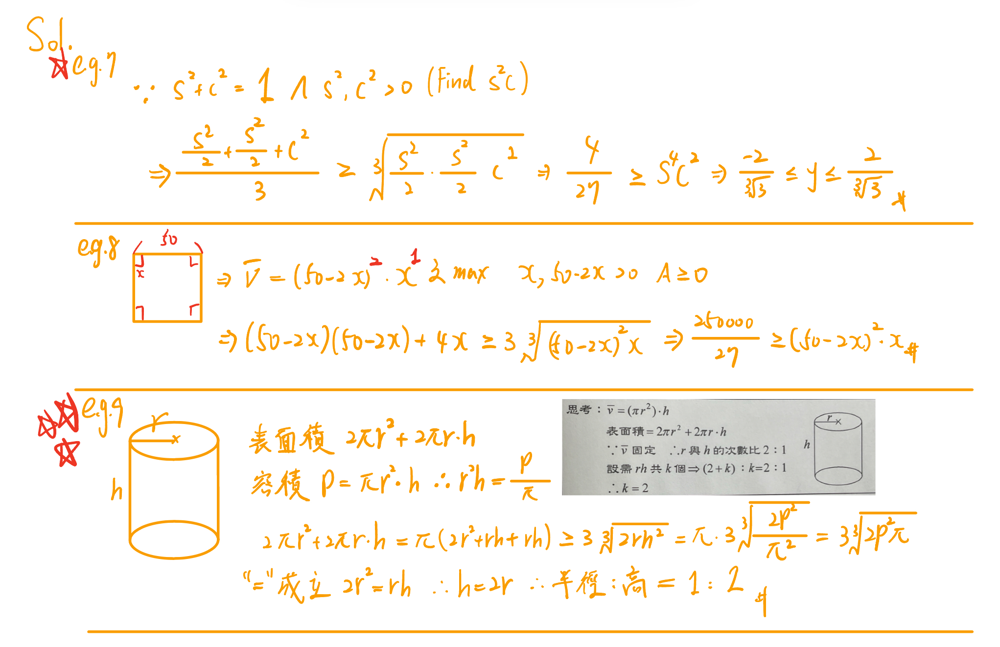

## 🟡 柯西不等式 (Cauchy–Schwarz inequality)

### 1️⃣ 定義

→ 已知: 兩數列:

$$\langle a_k \rangle_{k=1}^{k=n} = \langle a_1 \cdot a_2 \cdots a_n \rangle \quad a_k \in \mathbb{R}$$
$$\langle b_k \rangle_{k=1}^{k=n} = \langle b_1 \cdot b_2 \cdots b_n \rangle \quad b_k \in \mathbb{R}$$
$$\text{ 則: } \left ( a_1^2 + a_2^2 + \dots + a_n^2 \right ) \left ( b_1^2 + b_2^2 + \dots + b_n^2 \right ) \ge (a_1 b_1 + \dots + a_n b_n)$$

→ 其中: "=" 成立時，a₁ / a₂ = a₂ / a₃ … aₙ / bₙ

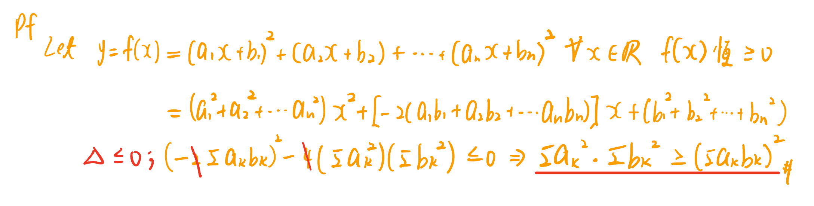

### 2️⃣ 何時使用柯西不等式

→ (平方和 A)(平方和 B) ≥ (乘積和)²

- 已知平方和 A，求乘積和之最大最小值
- 已知平方和 B，求平方和 A 最小值
- 已知乘積和，求平方和 A 最小值

### 3️⃣ 如何使用柯西不等式

→ 先畫格子，先填平方和，在填乘積和

> 💡e.g.1: 已知 sin²θ + cos²θ = 1; 求 a⋅sin²θ + b⋅cos²θ 之最大值?
>
> ```Sol
> ⇒ ((sinθ)² + (cosθ)²)((a)² + (b)²) ≥ (a⋅sinθ + b⋅cosθ)²
> ```
>
> 💡e.g.2: 已知 2x + y = 5，求 (x - 1)² + (y + 2)² 之最小值?
>
> ```Sol
> ((2)² + (1)²)((x - 1)² + (y + 2)²) ≥ (2(x - 1) + (y + 2))²
> ```
>
> 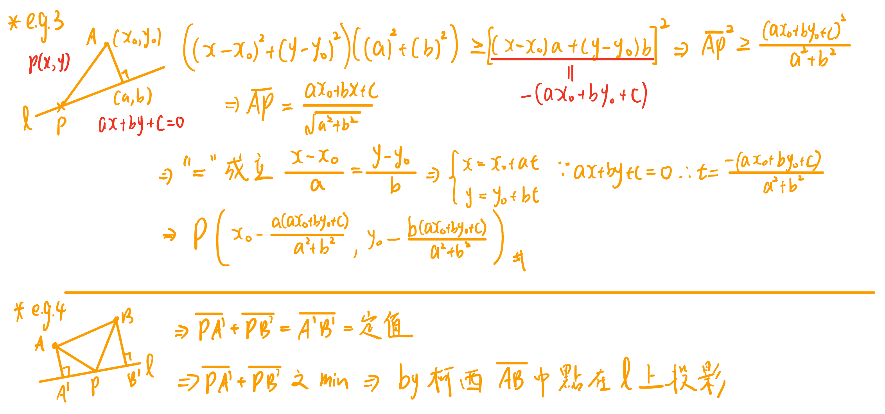

> **📌 範例:**
>
> $$\text{💡e.g.1: 設 } ~ x,y \in \mathbb{R}，\vec{a} = (x, ~ 2)，\vec{b} = (1, ~ y)，$$
>
> $$若 ~ x^2 + y^2 = 5 ~ ，求 ~ \vec{a} \cdot \vec{b} ~ 之最小值$$
>
> $$\text{💡e.g.2: 試求 } ~ \frac{4}{\cos^2{\theta}} + \frac{1}{\sin^2{\theta}} ~ 之最小值?$$
>
> $$\text{💡e.g.3: 設 } ~ x, ~ y ~ 為實數且滿足 ~ 3x + 4y = 2 ~ ，試求 ~ x^2 + y^2 ~ 的最小值，$$
>
> $$並且 ~ x, ~ y ~ 分別為何?$$
>
> $$\text{⭐e.g.4 設 } a, ~ b ~ 為正數，則試求 ~ (a + \frac{4}{b})(b + \frac{9}{a}) ~ 之最小值?$$
>
> 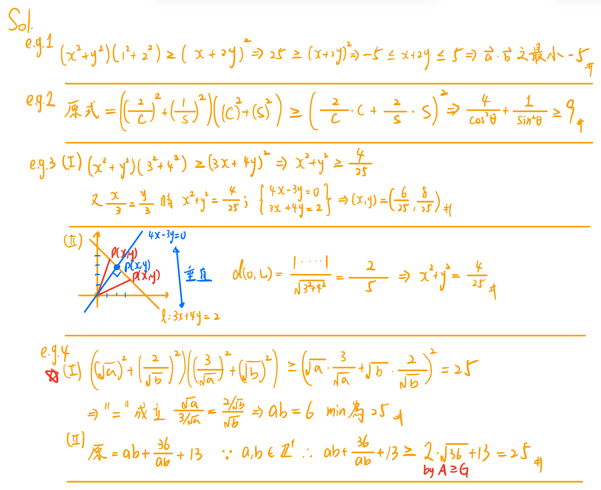
>
> $$\text{⭐e.g.5 } \triangle  ABC 三邊長為 ~ 4, ~ 5, ~ 6 ~ ，若 ~ p ~ 為三角形內部一點，$$
>
> $$p ~ 到三邊的距離分別為 ~ x, ~ y, ~ z ~ ，求 ~ x^2 + y^2 + z^2 ~ 的最小值為?$$
>
> $$\text{⭐e.g.6 設 } a + b + c + d = 5, ~ a^2 + b^2 + c^2 + d^2 = 8, ~ 求 ~ d ~ 之範圍?$$
>
> $$\text{💡e.g.7 若 } a, ~ b, ~ c \in \mathbb{R}^{+} ，且 ~ a + 2b + 3c = 10，則:$$
>
> $$1. ~ 試求 ~ a^2 + b^2 + c^2 ~ 之最小值=?$$
>
> $$2. ~ 又此時 ~ a, ~ b, ~ c ~ 分別為何?$$
>
> $$\text{⭐e.g.8 設 } x, ~ y, \in \mathbb{R}，求 ~ \frac{x + 2y + 3}{\sqrt{x^2 + y^2 + 1}} ~ 之最大值?$$
>
> 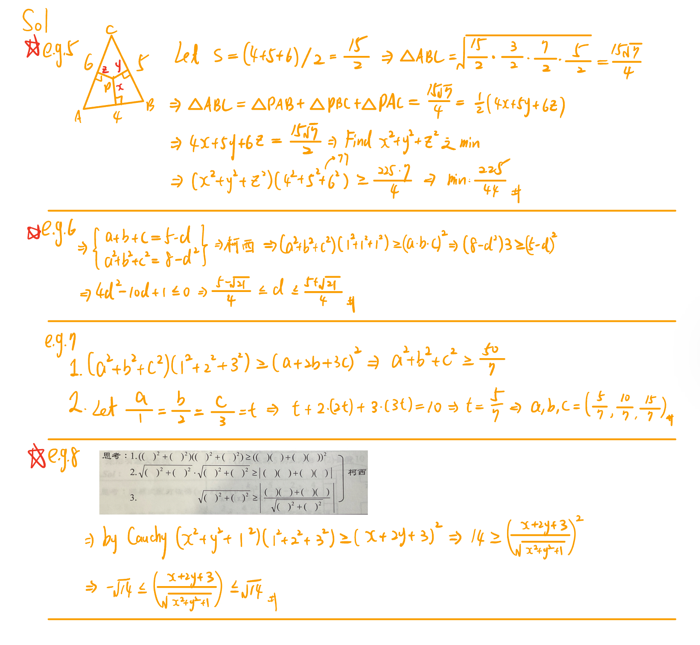

## 🟡 畫圖

> **📌 範例:**
>
> $$\text{💡e.g.1.1: 設 } f(x) = | x - 1 | + | x - 2 | + | x - 4 | + | x - 8 | + | x - 10 |$$
>
> $$則當 ~ x ~ 為多少, ~ f(x) ~ 最小值為多少?$$
>
> $$\text{💡e.g.1.2: 設 } f(x) = | x + 2 | + | x - 2 | - 2| x - 1 |$$
>
> $$則 ~ f(x) ~ 最大值為多少?, ~ f(x) ~ 最小值為多少?$$
>
> $$\text{💡e.g.2: 設 } -2 \le x \le 4 ~ ; ~ f(x) = | x^2 - 4 | -2x$$
>
> $$若 ~ f(x) ~ 的最大值為 ~ M，最小值為 ~ m ~ ，求數對 ~ (M, ~m) = ?$$
>
> $$\text{💡e.g.3: 若 x 為實數且 } \sqrt{(x - 3)^2 + 9} + \sqrt{(x + 3)^2 + 16} ~ 有最小值，則 ~ x ~ 值為何?$$
>
> 
>
> $$\text{💡e.g.4: 已知三點 } A(2, ~ 1), ~ B(4, ~ 3), ~ C(-3, ~ 4) ~ 及直線 ~ L: x - 2y + 5 = 0，求以下:$$
>
> $$\text{ (1) 在直線 L 上找一點 P，使 } \overline{PA}^2 + \overline{PB}^2 ~ 之值最小，則 ~ P ~ 之座標為和?$$
>
> $$\text{ (2) 在直線 L 上找一點 Q，使 } \overline{BQ} + \overline{CQ} ~ 之值最小，則 ~ Q ~ 之座標為和?$$
>
> $$\text{⭐e.g.5: 設直線 } L: ~ x - y - 2 = 0, ~ A(5, ~ -1), ~ B(0, ~ 1)，$$
>
> $$在 ~ L ~ 上找一點 ~ P ~ 的座標，使 ~ | \overline{PA} - \overline{PB} | ~ 有最大值。$$
>
> $$\text{💡e.g.6: 函數 } ~ f(x) = \frac{|x|}{x} ~ 的值域為?$$
>
> $$\text{⭐e.g.7: 設 } ~ A(6, ~ 2), ~ D(3, ~ 4)，在 ~ x ~ 軸, ~ y ~ 軸依次取 ~ B, ~ C ~ 兩點，$$
>
> $$使四邊形 ~ ABCD ~ 的周長為最小，則此最小值為?$$
>
> 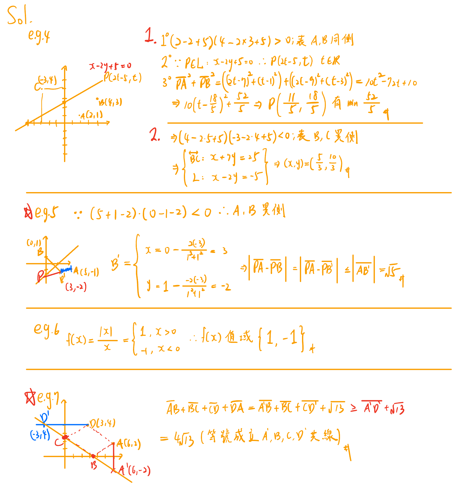

## 🟡 參數

> **📌 範例:**
>
> $$\text{💡e.g.1: 設 P 為拋物線 } ~ y = x^2 - 2x + 3 ~ 上任一點，則: $$
>
> $$(1) ~ 試求 ~ P ~ 到直線 ~ L: ~ 2x - y - 5 = 0 ~ 的最短距離?$$
>
> $$(2) ~ 若 ~ A(2, ~ -1), ~ B(3, ~ 1), 求  ~ ∆PAB ~ 的最小面積為?$$
>
> $$\text{💡e.g.2: 對於任何實數 } \theta， ~ 試求 ~ \frac{2\sin{\theta} - 5}{2\sin{\theta} - 3} ~ 的最大值? ~ 最小值?$$
>
> $$\text{⭐e.g.3: 設 } ~ P(1 + 5 \cos{\theta}, ~ 1 + 5 \sin{\theta})，\theta \in \mathbb{R}，為平面上任一點$$
>
> $$且 ~ A(10, ~ 13) ~ 為平面上一定點，則:$$
>
> $$(1) ~ 求 ~ (5\cos{\theta} - 5)^2 + (5\sin{\theta} - 12)^2 ~ 的最小值? ~ 此時 ~ P ~ 點座標為何?$$
>
> $$(2) ~ 求 ~ \overline{PA} ~ 的最小值? ~ 此時 ~ P ~ 點座標為何?$$
>
> $$(3) ~ 求 ~ \overline{PA} ~ 的最大值? ~ 此時 ~ P ~ 點座標為何?$$
>
> $$(4) ~ 若直線 ~ L: ~ 3x + 4y = 12，求點 ~ P ~ 到直線 ~ L ~ 之最大距離?$$
>
> $$及此時 ~ P ~ 點座標為何?$$
>
> 

## 🟡 微分
