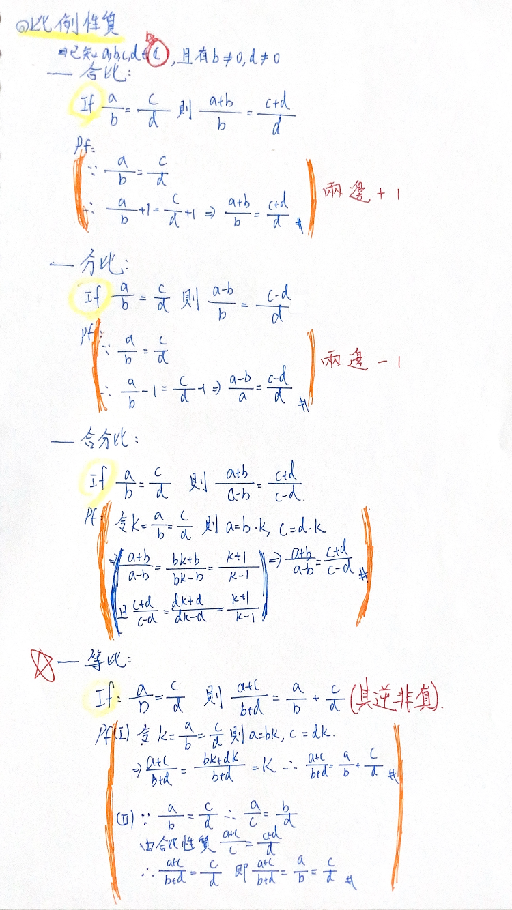

# 📖 五年級

## 🟡 分數加法

**📌 理論: 埃及分數分解（Egyptian fraction decomposition）: 任意正有理數都能分解成有限個單位分數之和**


$$\frac{a}{b} ~ 取最小整數 ~ n = \left\lceil \frac{b}{a} \right\rceil$$
$$使得 ~ \frac{1}{n} \leq \frac{a}{b}$$
$$將分數拆解為(貪婪演算法)：\frac{a}{b} = \frac{1}{n} + \left(\frac{a}{b} - \frac{1}{n}\right)$$
$$對於剩下的分數\frac{a}{b} - \frac{1}{n},重複以上過程。$$

**📌 特殊應用: 任一個單位分數可以找到兩個單位分數和**

$$\frac 1 n = \frac{1}{n + 1} + \frac{1}{n (n + 1)}$$
$$\because \frac{n + 1}{n(n + 1)} = \frac{n}{n(n + 1)} + \frac{1}{n (n + 1)}$$

```proof
1/a + 1/b = 1/c; a, b, c ∈ Z
=> (b+a)/ab = 1/c => c(b+a) = ab => c = ab/(b+a)
=> a+b | ab => c ∈ Z
```

**📌 範例:**

$$\frac 1 4 = \frac 1 5 + \frac{1}{20}$$

## 🟡 比例性質

> 

## 🟡 倍數判別

> 2 的倍數判別法: 整數的個位數字為 0、2、4、6、8
>
> 3 的倍數判別法: 整數的各位數字和為 3 的倍數
>
> 4 的倍數判別法: 末兩位數字為4的倍數
>
> 5 的倍數判別法: 個位數字為 0、5
>
> 6 的倍數判別法: 同時滿足 2, 3 的倍數判別
>
> 7 的倍數判別法: 去掉末位減去末位數的 2 倍
>
> > (e.g. 30401 ⇒ 3040 - 2 = 3038 ⇒ 303 - 16 ⇒ 287 ⇒ 28 -14 = 14; 7 | 14)
> >
> > ```proof
> > ⇒ 21 = 7 × 3; If 7 | n, ∀n ∈ ℚ⁺; 7 | (n - 21)
> > ∵ abc = 100a + 10b + c = 10ab + c
> > ∴ abc - 21c(可視為減去21倍數再判斷) = 10ab - 20c = 10 × (ab - 2c) ⇒ 7 | (ab - 2c)
> > ```
>
> 9 的倍數判別法: 整數的各位數字和為 9 的倍數
>
> 11 的倍數判別法: 1. 去掉末位減末位 1 倍; 2. 奇數位和減偶數位
>
> > ```proof
> > abcd → ab(c - d) → a(b - c + d) → a - b + c - d
> >
> > ```
>
> 13 的倍數判別法: 去掉末位減末位 9 倍 (via 91 = 13 × 7: 減掉 91c)
>
> > (e.g. 1313 ⇒ 131 - 27 = 104 ⇒ 10 - 36 ⇒ 13 | -26)
>
> 17 的倍數判別法: 去掉末位減末位 5 倍 (via 51 = 17 × 3)
>
> 19 的倍數判別法: 1. 去掉末位減末位 17 倍 (via 171 = 19 × 9); 2. 去掉末位加上末位的兩倍
>
> ⮕ (10(ab - 17c) = 10(ab + 2c): 等價加上19c)
>
> > (e.g. 3344 ⇒ 334 + 8 = 342 ⇒ 34 + 4 ⇒ 19 | 38)
>
> 💡 其他判別法: 1001 判斷: 去掉後三位減去後三位，以此類推，最後剩的三位判斷他是不是 7, 11, 13 的倍數就行了，可用於判斷大於十位數 (abcdefg = abcd × 1000 + efg = (abcd - efg) × 1000 + efg × 1001)
>
> (e.g. 654321 ⇒ 654 - 321 = 333; 7 ∤ 333, 11 ∤ 333, 13 ∤ 333)

## 🟡 質因數和

```

```
