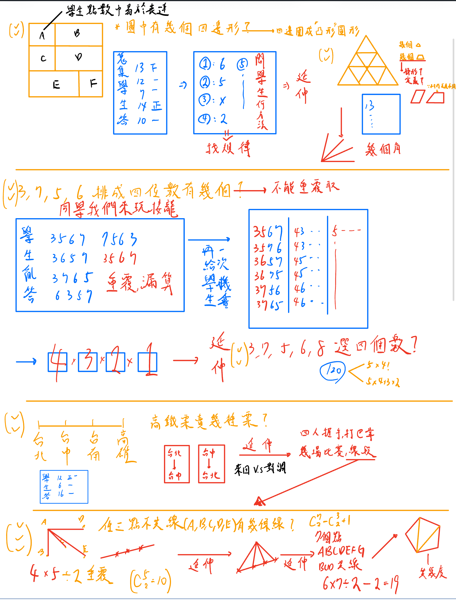

# ⭕ 題目

- 影片鏈結
  [🔗：瀚陞1](https://www.youtube.com/watch?v=i5RXXHMRyzU)
  [🔗：瀚陞2](https://www.youtube.com/watch?v=U9B-5QHi5K0)
  [🔗：瀚陞3](https://www.youtube.com/watch?v=F547L07feMA)

# 🟡 上課筆記

// 團班: 學生20-25位, 家長10-15位
// 專注能讓時間感覺變快

📌: 解釋獎卡意義

- 五個勾(依照班級狀況可能四個)換一張獎卡
- 一卡換3.5 點(get點) 特殊活動可能會變成 5 點

💡Q: 學生自己亂勾怎麼辦?

- 舉手-> 打勾
- 有答案的舉手

💡Q: 如果同學發現只要隨便答案就拿一個勾? A: 同學亂答勾要收回來喔

- 有錯要覺得很開心不要怕(心態很重要: 賺到一題，從不會 -> 到會)
- 聽得懂這位學生的舉手(來那他用了甚麼方法)
- 答對的舉手兩個勾。你知道錯哪裡嗎說說看(一個勾)，
- 不錯喔，你從剛剛不會畫圖到會畫圖
- 有答案的舉手，(好在 15 秒)
- 釐清觀念(描述梯形: 依照學生說明的刻意不照學生的講法操作為何要不一樣長因為要讓一邊平行一邊不平行)(四邊形:四個邊長圍成的凸多邊形

💡Q: 如果問的學生馬上說出標準答案，沒有其他錯誤的引導呢?

- 誰還沒講過話
- 學生在在寫，可以偷寫下一題
- 可以引導學生不要太兇解釋另一個同學(兩個同學對的但是方法不同)
- 跑在學生之前

Q: 高鐵票有幾種方式(要對調c(4, 2)\*2!), 互相打巴掌(再乘2)or道歉信 versus 握手(不要對調c(4, 2)), 幾個線段, 比賽

# 🟡 思考

1. 提問理答
2. 有效互動
3. 較少發言小孩之應對
