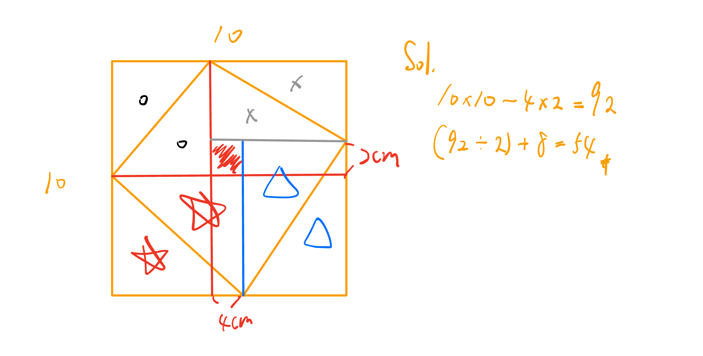

# 🟡 上課筆記

## ⭕ 10/24 M455上

> - 授課老師：方嘉老師
> - 單元：小數乘法

### 1️⃣ 課程流程

- 19:30 ~ 20:10 開課題
- 20:00 ~ 20:27 訂正考卷
- 20:28 ~ 20:48 上課
- 20:48 ~ 21:00 講觀念
- 21:00 ~ 21:30 寫例題

### 2️⃣ 印象深刻的題

### 3️⃣ 教學目標

- 長方形面積一半例題應用題
- 有單位 V.S. 沒單位(比較量 V.S. 比值)
- 整數 × 小數(老師Demo); 小數 × 小數(學生Pratice)
- 小數心算跳位問題

### 4️⃣ 問題設計與引導

- 老練的問答
- 師生同頻且有共鳴

### 5️⃣ 學生參與情形

- 學生踴躍，思考開放

### 6️⃣ 班級經營與氣氛

- 完成自發，互動，共好

### 🔦 互動討論

### 🔦 思考

- 學習聽學生說甚麼，引導學生自發解題

---
